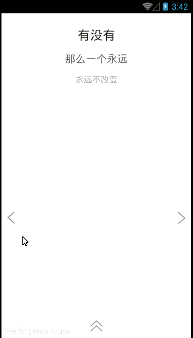

# android-image-slide-panel
image as a card, which can be slided to the left or the right and fade away 

To highlight my English skills, i decide to create this README.md file in English this time. 
Here should arise some applause. 

####original intention
There exists a Chinese app "初页" which enables users to customize their gorgeous html5 pages, which is really cool. I was totally shocked at the first sight of those various splendid H5 visual effects.   
Recently, as i was not busy at my work time, i decide to implement one of those fantastic effects in native android language. However, while i was able to control every details when sliding the image which is on the screen, i added some new features to this demo, and maybe you will like it more. 
####features
* only the foremost image could be slided to the horizontal side of the screen and fade away.
* the image which was faded away is restored at the bottom of the view stack.
* all the images could be reborn without creating a new view.

####captured images
<td>
  
  
</td>

#### demo apk
[apk download](firstPage_template1.apk) (right in this github project)

####extras
When you see the source files, you will find that there exists lots of Chinese explainations. However, i did not complete a commonly used ViewGroup widget which is compatable with all kinds of veiws.  
And, i m clear about one thing: the imageViews could be replaced with other kinds of components, such as Fragments/LinearLayout and so on.   
Anything problems, please contact my email: 120809170@qq.com
